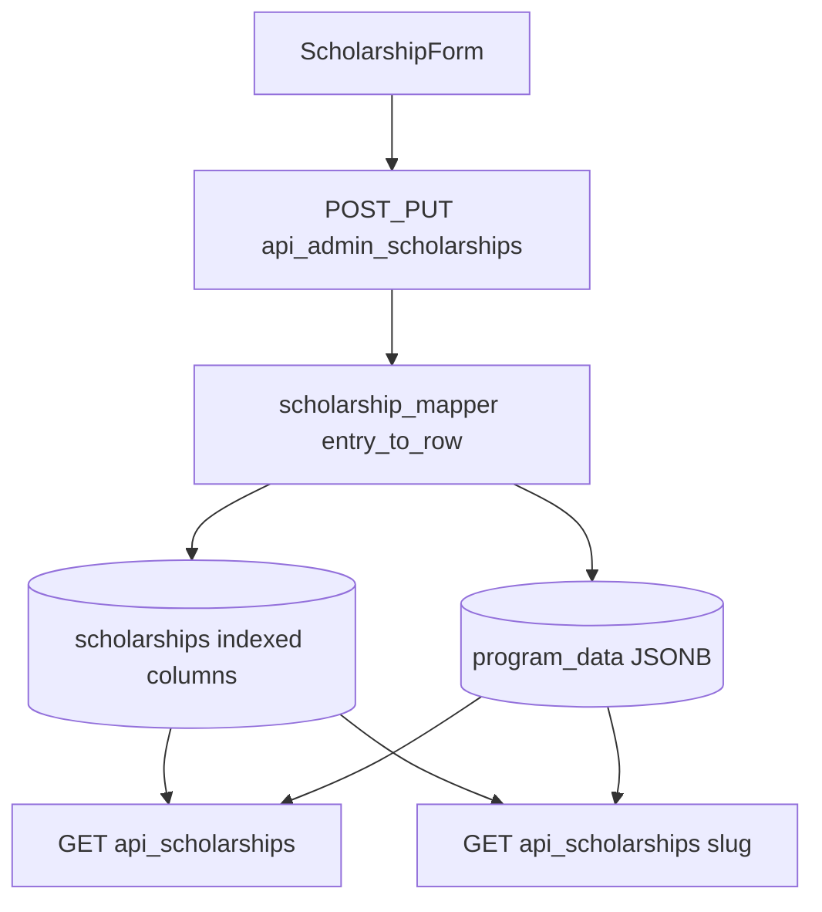

# Admin scholarship questionnaire implementation

## Decisions (confirmed)

- **Verification:** Dual model — keep `verified` boolean for the public badge; add `verification_status` column + API `verificationStatus`. On save: `verified = (verificationStatus === "yes")`.
- **Storage (hybrid):**
  - **Indexed columns** — single-value questionnaire fields used for admin/public filters and SQL (`application_status`, `data_verification_status`, `verification_status`, `degree_level`, `german_level_required`, `visa_sponsorship`, `accommodation_support`, `intake_month`, `program_duration`, `recognition_support`, `interview_required`, `application_method`, `provider_type`). Existing columns reused: `program_type`, `funding`, `verified`.
  - **JSONB `program_data`** — multi-select and long-tail: `languagesOfInstruction`, `targetApplicants`, `benefits`, `requiredDocuments`, `tags`, plus narrative fields (`about`, `eligibility`, `applicationProcess`, `*De` copies).
- **Alembic:** Included in Phase 2 (before mapper/form rely on columns). Backfill existing rows from `program_data` where keys exist; nullable columns with sensible defaults.
- **Public site:** Full filter/display on [`/scholarships`](frontend/src/routes/scholarships.tsx); public list API gains optional query params for server-side filter (e.g. `?application_status=open`).



---

## Phase 1 — Options + admin UI primitives

**New file:** [`frontend/src/lib/scholarshipFieldOptions.ts`](frontend/src/lib/scholarshipFieldOptions.ts)

- Export typed option arrays for every field from the questionnaire (value + label).
- Export `ProgramType` values extended beyond today’s 3:
  - `ausbildung`, `nursing_scholarship`, `caregiver_pathway`, `internship`, `vocational_training`, `other`
- Export helpers: `optionLabel(field, value)`, `isAllowedValue(field, value)`.

**New components** under [`frontend/src/components/admin/`](frontend/src/components/admin/):

| Component | Purpose |
|-----------|---------|
| `AdminSelect.tsx` | Single dropdown from options |
| `AdminRadioGroup.tsx` | Yes/No/Pending, Yes/No/Maybe, etc. |
| `AdminCheckboxGroup.tsx` | Multi-select for benefits, documents, tags, target applicants, languages |

Reuse [`FormField`](frontend/src/components/admin/FormField.tsx) wrapper; match existing border/ring styles from `TextInput`/`TextArea`.

**Types:** Extend [`frontend/src/lib/scholarships.ts`](frontend/src/lib/scholarships.ts):

- Widen `ProgramType` union.
- Add `ScholarshipQuestionnaire` interface (optional fields: `verificationStatus`, `languagesOfInstruction`, `visaSponsorship`, `applicationStatus`, `tags`, `dataVerificationStatus`, …).
- Merge into `Scholarship` / `ScholarshipSummary` as optional keys.

---

## Phase 2 — Alembic migration + ORM model

**New revision:** `backend/alembic/versions/20260526_0006_scholarship_questionnaire_columns.py` (rev `0006`, after `0005`)

**Add nullable columns** on `scholarships` (VARCHAR lengths match enum value max):

| Column | Example values |
|--------|----------------|
| `verification_status` | yes, no, pending |
| `data_verification_status` | draft, under_review, approved, rejected, needs_update |
| `application_status` | open, closing_soon, closed, upcoming, suspended |
| `degree_level` | certificate, vocational_training, … |
| `german_level_required` | none, a1, …, flexible |
| `visa_sponsorship` | yes, no, not_specified |
| `accommodation_support` | free_accommodation, … |
| `intake_month` | january, …, december |
| `program_duration` | less_than_1_year, … |
| `recognition_support` | full_recognition_support, … |
| `interview_required` | yes, no, maybe |
| `application_method` | online_portal, … |
| `provider_type` | hospital, university, … |

**Indexes** (for admin analytics and list filters):

- `ix_scholarships_application_status` on `application_status`
- `ix_scholarships_data_verification_status` on `data_verification_status`
- `ix_scholarships_program_type` (if not already indexed)

**Backfill** in `upgrade()`:

```sql
UPDATE scholarships SET application_status = program_data->>'applicationStatus'
WHERE application_status IS NULL AND program_data ? 'applicationStatus';
-- repeat per column; map camelCase JSON keys to snake_case columns
```

Derive `verification_status` from `verified` when missing: `yes` / `no`.

**Update:** [`backend/app/db/models.py`](backend/app/db/models.py) — add `Mapped` columns on `Scholarship`.

**Data migration script (optional):** one-off Python in migration or `backend/scripts/backfill_scholarship_columns.py` for local DBs already seeded.

---

## Phase 3 — `ScholarshipForm` sections

**File:** [`frontend/src/components/admin/ScholarshipForm.tsx`](frontend/src/components/admin/ScholarshipForm.tsx)

Reorganize into sections (replace free-text where questionnaire specifies dropdowns):

1. **Classification** — program type, provider type, verification radio (`verificationStatus`), data verification status (admin dropdown)
2. **Application & intake** — application status, intake month, program duration, application method, interview required
3. **Requirements** — German language requirement, languages of instruction (multi), visa sponsorship, accommodation, recognition support
4. **Funding** — funding type dropdown (maps to column `funding`)
5. **Audience & content** — target applicants (multi), tags (multi); keep provider name, location, category as text or dropdown per options
6. **Benefits & documents** — `AdminCheckboxGroup` bound to `benefits` / `requiredDocuments` arrays (remove line-based textareas for these; keep `applicationProcess` / `eligibility` as textareas for now unless you add option lists later)
7. **English / German copy** — existing title, slug, descriptions, about
8. **Links** — `applicationLink`, `officialLink`

**Submit payload:**

- Include all new keys in `payload` sent to `onSubmit`.
- On load from `initial`, derive `verificationStatus` from `verified` if missing: `verified ? "yes" : "no"`.
- Remove `benefitsText` / `requiredDocumentsText` conversion for fields switched to checkbox arrays.

**`emptyScholarship()` defaults:** sensible defaults (`verificationStatus: "pending"`, `dataVerificationStatus: "draft"`, `applicationStatus: "open"`, empty arrays for multi-selects).

---

## Phase 4 — Backend validation + mapper sync

**New file:** [`backend/app/schemas/scholarship_fields.py`](backend/app/schemas/scholarship_fields.py)

- Mirror frontend option sets as Python `frozenset`s per field.
- `validate_scholarship_questionnaire(body: dict) -> dict` — reject unknown enum values with 400.

**Update:** [`backend/app/services/scholarship_mapper.py`](backend/app/services/scholarship_mapper.py)

- Expand `COLUMN_KEYS` with new camelCase API keys mapped to snake_case columns in `entry_to_row` / `apply_row_to_model`.
- Write single-value fields to **columns**; multi-select arrays remain in `program_data` only (remove duplicate keys from JSONB on save to avoid drift).
- `verificationStatus` → `verification_status` column + `verified` boolean sync.
- `row_to_public`: emit camelCase from columns first, fall back to `program_data` for legacy rows.
- `_SUMMARY_PROGRAM_KEYS`: add filter fields served from columns (`applicationStatus`, `germanLevelRequired`, `tags` still from JSONB).

**Update:** [`backend/app/routers/scholarships.py`](backend/app/routers/scholarships.py)

- Optional query params on list: `application_status`, `program_type`, `data_verification_status` (admin-only param behind auth or separate admin list endpoint).
- Apply SQLAlchemy `.filter()` when params present; keeps client filters working without params.

**Update:** [`backend/app/routers/admin_content.py`](backend/app/routers/admin_content.py) — validation before save; admin list may use same filtered query.

---

## Phase 5 — Admin dashboard table + filters

**File:** [`frontend/src/routes/admin/scholarships/index.tsx`](frontend/src/routes/admin/scholarships/index.tsx)

- Add columns: Program type, Application status, Data verification status, Funding, Verification status.
- Add filter row: dropdowns for `dataVerificationStatus`, `applicationStatus`, `programType` — prefer **server-side** via `GET /api/admin/scholarships?application_status=open` after migration (fallback to client filter if param omitted).
- Display labels via `scholarshipFieldOptions` (not raw values).
- Optional: use `row_to_public(..., include_detail=False)` for admin list API later — out of scope unless list feels slow.

---

## Phase 6 — Public scholarships page (full filters/display)

**Files:**

- [`frontend/src/routes/scholarships.tsx`](frontend/src/routes/scholarships.tsx) — new filter chips/dropdowns: application status, funding type (match `funding`), tags (any-match), German level required, extended program types.
- [`frontend/src/locales/en/scholarshipsPage.json`](frontend/src/locales/en/scholarshipsPage.json) + `de` — filter labels and badge text.
- [`frontend/src/lib/scholarships.ts`](frontend/src/lib/scholarships.ts) — extend `ScholarshipSummary` with filter/display fields from summary API.

**Card UI:**

- Badge for `applicationStatus` (e.g. Open / Closing soon).
- Small tag chips from `tags` (max 2–3 visible).
- Keep existing `verified` badge when `verified === true`.

**Filter logic:** extend client `filtered` reducer for text search, tags, and fields not in query params; pass `application_status`, `program_type`, `german_level_required` to `fetchScholarships({ ... })` when user selects filters (server-side).

**Detail page** [`scholarships.$slug.tsx`](frontend/src/routes/scholarships.$slug.tsx): facts row for visa, accommodation, intake month, duration — from column-backed API fields.

---

## Verification checklist

1. Create scholarship in admin with all field types; reload edit form — values persist.
2. `verificationStatus: pending` → `verified: false` on public list; `yes` → badge shows.
3. Invalid enum in API body → 400 from admin endpoint.
4. Admin table filters narrow rows correctly.
5. Public `/scholarships` filters work with summary payload; detail page shows extended fields.
6. Existing seeded scholarships without new keys still load (defaults in form + mapper).
7. `alembic upgrade head` applies columns; backfill populates from JSONB; `SELECT ... WHERE application_status = 'open'` returns expected rows.

---

## Files touched (summary)

| Area | Files |
|------|--------|
| Migration + model | `alembic/versions/20260526_0006_*.py`, `db/models.py` |
| Options + types | `scholarshipFieldOptions.ts`, `scholarships.ts` |
| Admin UI | `AdminSelect.tsx`, `AdminRadioGroup.tsx`, `AdminCheckboxGroup.tsx`, `ScholarshipForm.tsx` |
| Admin list | `admin/scholarships/index.tsx`, `lib/adminApi.ts` |
| Backend | `scholarship_fields.py`, `scholarship_mapper.py`, `admin_content.py`, `scholarships.py` |
| Public | `scholarships.tsx`, `scholarships.$slug.tsx`, `api/scholarships.ts`, locale JSON |
