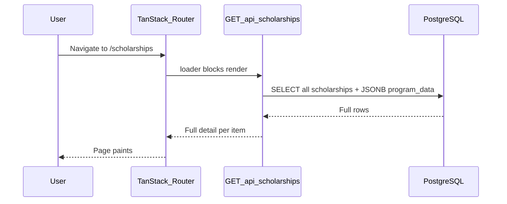

# Scholarships page: reduce first-load lag

## Current behavior (root cause)



**Route:** [`frontend/src/routes/scholarships.tsx`](frontend/src/routes/scholarships.tsx) uses a blocking loader:

```ts
loader: () => fetchScholarships(),
```

**API:** [`backend/app/routers/scholarships.py`](backend/app/routers/scholarships.py) returns the same shape for list and detail:

```python
return [row_to_public(r) for r in rows]
```

**Mapper:** [`backend/app/services/scholarship_mapper.py`](backend/app/services/scholarship_mapper.py) `row_to_public()` merges the entire `program_data` JSONB blob (about, benefits[], eligibility[], applicationProcess[], all `*De` fields, etc.) for every scholarship.

**Reference (already optimized):** [`backend/app/routers/resources.py`](backend/app/routers/resources.py) list endpoint uses `row_to_public(r, include_body=False)` so list cards only get excerpt fields; full body loads on `/resources/$slug`.

**Partner schools:** `partner_schools` exists in [`backend/app/db/models.py`](backend/app/db/models.py) and scholarships have `partner_school_id`, but **no school data is joined or returned** today. The Partners page still uses static data in [`frontend/src/lib/partners.ts`](frontend/src/lib/partners.ts). Lag on `/scholarships` is from **oversized scholarship payloads**, not school fetches.

**Extra weight on first paint:** [`german-universities.png`](frontend/src/assets/german-universities.png) is ~1.7MB in production builds (bundled import in `scholarships.tsx`) — hurts LCP even after API returns.

---

## Recommended approach (phased)

### Phase 1 — Slim list API (highest impact, low risk)

Mirror the resources split:

| Endpoint | Payload |
|----------|---------|
| `GET /api/scholarships` | **Summary** — card fields only |
| `GET /api/scholarships/{slug}` | **Full** — current `row_to_public` output |

**Backend** — extend `row_to_public` in [`scholarship_mapper.py`](backend/app/services/scholarship_mapper.py):

```python
def row_to_public(scholarship: Scholarship, *, include_detail: bool = True) -> dict:
```

When `include_detail=False`, return only fields used by the list UI in [`scholarships.tsx`](frontend/src/routes/scholarships.tsx):

- Identity: `slug`, `programType`, `verified`, `hostCountry`
- Card text: `title`, `titleDe`, `shortDescription`, `shortDescriptionDe`, `provider`, `providerDe`, `funding`, `fundingDe`, `degreeLevel`, `degreeLevelDe`, `category`, `categoryDe`, `deadline`, `deadlineDe`
- Links: `officialLink`, `applicationLink`

**Omit on list:** `about`, `aboutDe`, `benefits`, `eligibility`, `requiredDocuments`, `applicationProcess`, and other long JSONB-only fields.

Update list handler:

```python
return [row_to_public(r, include_detail=False) for r in rows]
```

Optional DB tweak: use SQLAlchemy `load_only()` on list query for scalar columns + `program_data` (still needed for provider/funding in JSONB until those are promoted to columns). If many fields stay in JSONB, summary mode can read **only the keys needed for cards** from `program_data` instead of spreading the full dict.

**Frontend**

- Add `ScholarshipSummary` type in [`frontend/src/lib/scholarships.ts`](frontend/src/lib/scholarships.ts) (or `Pick<>` from `Scholarship`).
- `fetchScholarships()` returns `ScholarshipSummary[]`.
- List route + card components use summary type; detail route + `ChatWidget` keep full `Scholarship` via `fetchScholarshipBySlug`.

**Expected gain:** ~60–80% smaller JSON for ~9 scholarships today; scales linearly as catalog grows.

---

### Phase 2 — Perceived performance (UX, no schema change)

**Non-blocking shell** — configure the scholarships route so hero, navbar, filters render while data loads:

- `pendingComponent`: skeleton grid or spinner in the listings section
- Keep static sections (hero, intro) outside `useLoaderData()` dependency

**Loader caching** — reduce repeat navigations refetching (router has `defaultPreloadStaleTime: 0` in [`frontend/src/router.tsx`](frontend/src/router.tsx)):

```ts
loader: () => fetchScholarships(),
staleTime: 1000 * 60 * 5, // 5 minutes
```

**Navbar preload** — TanStack Router can prefetch on hover if `defaultPreload: 'intent'` is set on the router or scholarships link.

---

### Phase 3 — Assets and optional partner schools

**Image**

- Replace or compress `german-universities.png` (WebP, smaller dimensions, or host under `public/` with explicit `loading="lazy"` — already lazy, but import still bundles full size).
- Target &lt;200KB for hero/intro image.

**If you add partner schools to scholarship cards later**

- Do **not** embed full school rows in the list response.
- Add `GET /api/partner-schools?summary=1` (slug, `name_en`/`name_de`, `logo_url`, `city`) or join only `name` + `logo_url` in summary mapper when `partner_school_id` is set.
- Load school detail on Partners page or scholarship detail only.

---

### Phase 4 — When catalog grows (future)

- Server-side pagination: `GET /api/scholarships?page=1&limit=12`
- Server-side search/filter query params (move filter logic out of client `filtered` in `scholarships.tsx`)
- `Cache-Control` / ETag on list endpoint for CDN/browser cache

---

## Files to change (Phase 1 + 2)

| File | Change |
|------|--------|
| [`backend/app/services/scholarship_mapper.py`](backend/app/services/scholarship_mapper.py) | `include_detail` flag; summary builder |
| [`backend/app/routers/scholarships.py`](backend/app/routers/scholarships.py) | List uses `include_detail=False` |
| [`frontend/src/lib/api/scholarships.ts`](frontend/src/lib/api/scholarships.ts) | Summary return type |
| [`frontend/src/lib/scholarships.ts`](frontend/src/lib/scholarships.ts) | `ScholarshipSummary` type |
| [`frontend/src/routes/scholarships.tsx`](frontend/src/routes/scholarships.tsx) | Summary types, `staleTime`, `pendingComponent` |
| [`frontend/src/components/scholarships/ScholarshipCardLinks.tsx`](frontend/src/components/scholarships/ScholarshipCardLinks.tsx) | Accept `Pick` / summary type for links |
| Optional: [`frontend/src/assets/`](frontend/src/assets/) | Compress universities image |

Admin routes and `GET /api/scholarships/{slug}` stay unchanged (full payload).

---

## Verification

1. Network tab: `GET /api/scholarships` payload size before vs after (target large drop in KB).
2. `/scholarships` — hero visible quickly with pending skeleton; cards populate when API returns.
3. `/scholarships/{slug}` — still shows full about/benefits/eligibility.
4. Apply buttons and external title links still work (links present on summary).
5. German locale — card text still resolves via `scholarshipText` (`*De` fields on summary).
